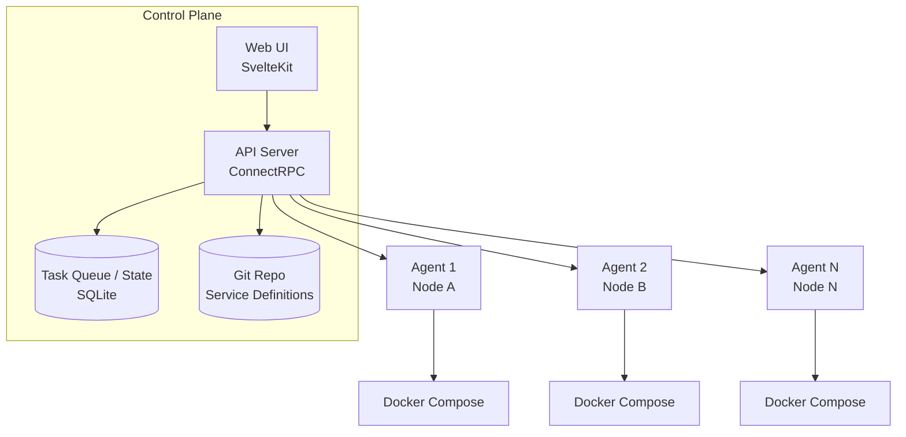

# Architecture Overview

Composia uses a control plane-agent (Controller-Agent) architecture that supports distributed multi-node service management.

## System Architecture



## Core Components

### Control Plane (Controller)

The control plane is the central hub of the system, running in its own container:

| Function | Description |
|----------|-------------|
| Configuration Management | Loading and maintaining service definitions from Git repositories |
| State Aggregation | Collecting status information from all agents |
| Task Scheduling | Assigning deployment tasks to appropriate agents |
| API Services | Providing Web UI and external integration interfaces |
| Data Persistence | Using SQLite for tasks and state storage |

### Execution Agents

Agents run on target Docker hosts:

| Function | Description |
|----------|-------------|
| Heartbeat Communication | Regularly reporting status to the control plane (default: 15 seconds) |
| Task Execution | Executing deployment, stop, restart, and other operations |
| Log Collection | Collecting and forwarding container logs |
| Runtime Summary | Reports disk capacity and Docker inventory statistics |
| Docker Operations | Directly managing local Docker containers |

### Web Interface

A modern management interface built with SvelteKit:

- **Service Management**: Create, edit, and deploy services
- **Node Monitoring**: View status of all agent nodes
- **Container Operations**: View logs, execute commands
- **Task Tracking**: Monitor task execution progress in real-time

## Communication

### ConnectRPC

Composia uses ConnectRPC for inter-service communication:

- Bidirectional streaming based on HTTP/2
- Protobuf serialization
- Compatible with gRPC-style tooling and Connect clients over HTTP
- Supports browser direct calls

### Authentication

| Component | Authentication Method |
|-----------|----------------------|
| Web UI → Controller | Controller access token (Bearer, from `controller.access_tokens`) |
| Agent → Controller | Node Token |
| Controller → Agent | Bearer token when calling controller-exposed RPCs |

## Data Flow

### Deployment Flow

```
User Request → Controller Validation → Create Task → Agent Pull → Execute Deploy → Report Result
```

1. User initiates a deployment request via Web UI or API
2. Controller validates service definition and permissions
3. Creates deployment tasks for each target node
4. Agent retrieves tasks via long-polling
5. Agent downloads service bundle and executes Docker Compose deployment
6. Agent reports execution result and container status

### Status Synchronization

```
Agent heartbeat / Docker stats reports → Controller aggregation → Web UI
```

- Agents send heartbeats every 15 seconds
- Heartbeats include node liveness and disk summary
- Agents also report Docker inventory statistics periodically
- Controller aggregates status from all agents into SQLite
- Web UI displays real-time status updates

## Core Object Model

```
Service (Service Definition)
    │
    ├── ServiceInstance (Node Instance) ── Container (Docker Container)
    │
    └── ServiceInstance (Node Instance) ── Container (Docker Container)
```

| Object | Description | Storage |
|--------|-------------|---------|
| Service | Logical service definition from Git repository | Git Repo |
| ServiceInstance | Deployment instance of a service on a specific node | SQLite |
| Container | Actual Docker container | Docker Daemon |
| Node | Docker host where an Agent runs | Controller Config |

## Security

| Layer | Measures |
|-------|----------|
| Authentication | Token-based authentication |
| Transport | TLS encryption supported (recommended for production) |
| Authorization | Principle of least privilege; agents only access assigned services |
| Secrets | Encrypted storage using age |

## Scalability

- **Horizontal Scaling**: Add more Agent nodes to manage more Docker hosts
- **Service Scaling**: Deploy the same service to multiple nodes
- **Load Balancing**: Multi-instance load balancing through Caddy configuration

## Deployment Patterns

### Single-Node Mode

```
┌─────────────────────────────────────┐
│           Single Server             │
│  ┌──────────┐    ┌───────────────┐  │
│  │Controller│◄──►│     Agent     │  │
│  └──────────┘    └───────┬───────┘  │
│                          │          │
│                   ┌──────▼──────┐   │
│                   │   Docker    │   │
│                   └─────────────┘   │
└─────────────────────────────────────┘
```

### Multi-Node Mode

```
┌─────────────────┐
│    Controller   │
└────────┬────────┘
         │
    ┌────┴────┬────────┬────────┐
    ▼         ▼        ▼        ▼
┌───────┐ ┌───────┐ ┌───────┐ ┌───────┐
│Agent 1│ │Agent 2│ │Agent 3│ │Agent N│
└───┬───┘ └───┬───┘ └───┬───┘ └───┬───┘
    │         │         │         │
┌───▼───┐ ┌───▼───┐ ┌───▼───┐ ┌───▼───┐
│Docker │ │Docker │ │Docker │ │Docker │
│Node 1 │ │Node 2 │ │Node 3 │ │Node N │
└───────┘ └───────┘ └───────┘ └───────┘
```
