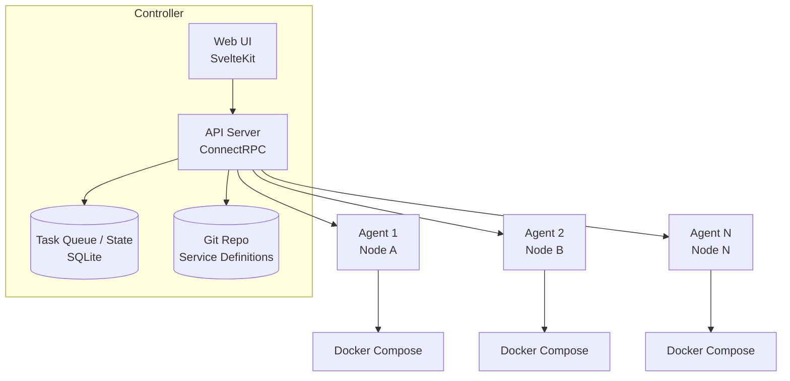
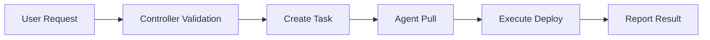
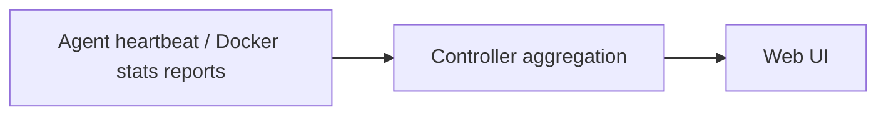
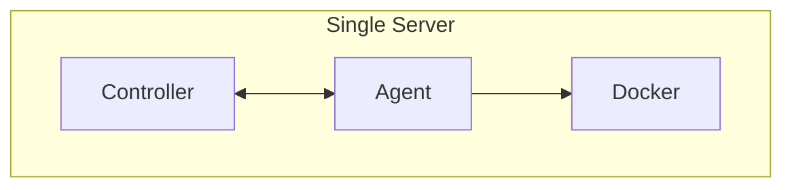
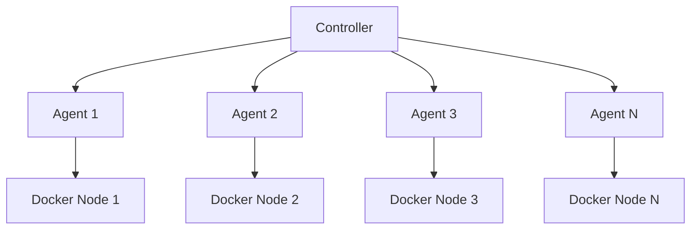

# Architecture Overview

Composia uses a controller-agent architecture: the **Controller** makes decisions and schedules work, while **Agents** execute on each Docker host. This pattern is sometimes called a "control plane" — the coordination layer that manages the actual workloads.

## System Architecture

## Core Components

### Controller

The Controller is the central hub of the system — it decides what should happen and delegates execution to agents:

| Function | Description |
|----------|-------------|
| Configuration Management | Loading and maintaining service definitions from Git repositories |
| State Aggregation | Collecting status information from all agents |
| Task Scheduling | Assigning deployment tasks to appropriate agents |
| API Services | Providing Web UI and external integration interfaces |
| Data Persistence | Using SQLite for tasks and state storage |

### Execution Agents

Agents run on target Docker hosts:

| Function | Description |
|----------|-------------|
| Heartbeat Communication | Regularly reporting status to the Controller (default: 15 seconds) |
| Task Execution | Executing deployment, stop, restart, and other operations |
| Log Collection | Collecting and forwarding container logs |
| Runtime Summary | Reports disk capacity and Docker inventory statistics |
| Docker Operations | Directly managing local Docker containers |

### Web Interface

A modern management interface built with SvelteKit:

- **Service Management**: Create, edit, and deploy services
- **Node Monitoring**: View status of all agent nodes
- **Container Operations**: View logs, execute commands
- **Task Tracking**: Monitor task execution progress in real-time

## Communication

### ConnectRPC

Composia uses ConnectRPC for inter-service communication:

- Bidirectional streaming based on HTTP/2
- Protobuf serialization
- Compatible with gRPC-style tooling and Connect clients over HTTP
- Supports browser direct calls

### Authentication

| Component | Authentication Method |
|-----------|----------------------|
| Web UI → Controller | Controller access token (Bearer, from `controller.access_tokens`) |
| Agent → Controller | Node Token |
| Controller → Agent | Bearer token when calling controller-exposed RPCs |

## Data Flow

### Deployment Flow

1. User initiates a deployment request via Web UI or API
2. Controller validates service definition and permissions
3. Creates deployment tasks for each target node
4. Agent retrieves tasks via long-polling
5. Agent downloads service bundle and executes Docker Compose deployment
6. Agent reports execution result and container status

### Status Synchronization

- Agents send heartbeats every 15 seconds
- Heartbeats include node liveness and disk summary
- Agents also report Docker inventory statistics periodically
- Controller aggregates status from all agents into SQLite
- Web UI displays real-time status updates

## Object Model

Composia models infrastructure as four objects: **Service** (logical definition), **ServiceInstance** (per-node deployment), **Container** (actual Docker process), and **Node** (Docker host). For a detailed walkthrough of how they relate, see [Core Concepts](./core-concepts).

## Security

| Layer | Measures |
|-------|----------|
| Authentication | Token-based authentication |
| Transport | TLS encryption supported (recommended for production) |
| Authorization | Principle of least privilege; agents only access assigned services |
| Secrets | Encrypted storage using age |

## Scalability

- **Horizontal Scaling**: Add more Agent nodes to manage more Docker hosts
- **Service Scaling**: Deploy the same service to multiple nodes
- **Load Balancing**: Multi-instance load balancing through Caddy configuration

## Deployment Patterns

### Single-Node Mode

### Multi-Node Mode

