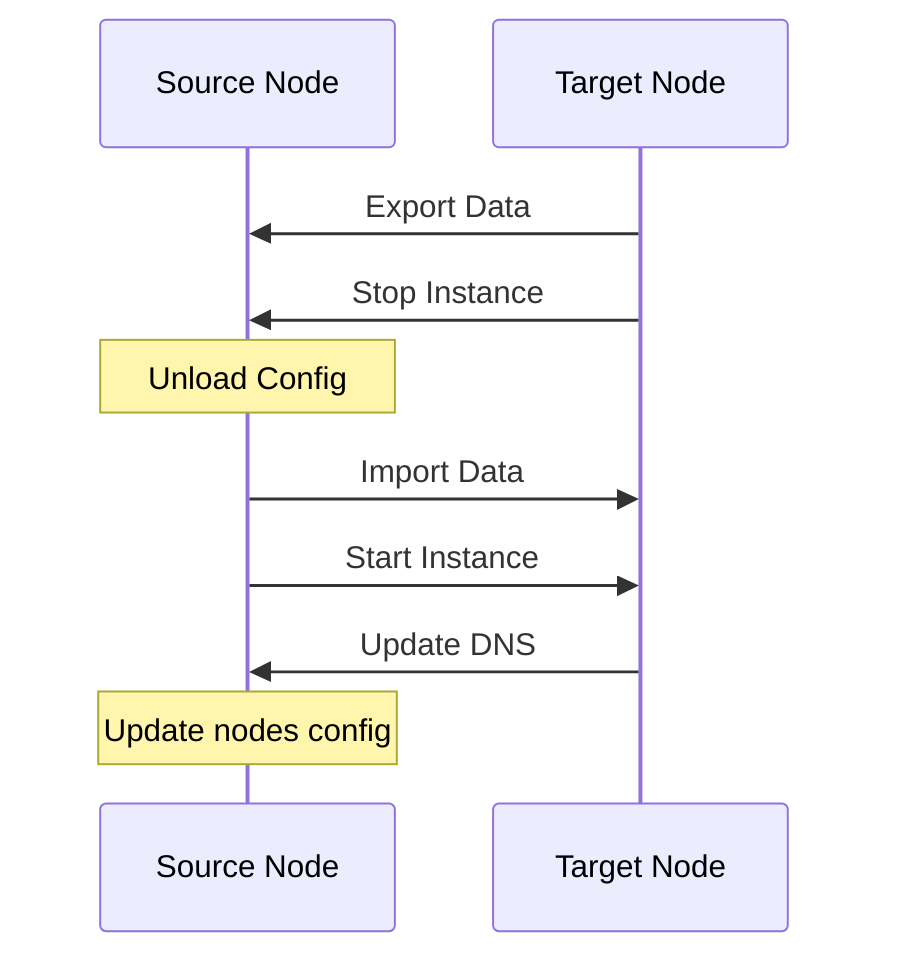

# Backup & Migration

This document explains Composia's data backup and migration features.

## Backup Functionality

### Overview

Composia's backup functionality is based on the following components:

- **rustic**: Backup engine supporting incremental backups, encryption, and compression
- **data_protect**: Defines data items that can be backed up and their strategies
- **backup**: Defines which data items participate in backups

### 1. Deploy Rustic Infrastructure

Create a rustic infrastructure service:

```yaml
# infra-backup/composia-meta.yaml
name: infra-backup
nodes:
  - main

infra:
  rustic:
    compose_service: rustic
    profile: default
    data_protect_dir: /data-protect
    init_args:
      - --set-chunker
      - rabin
      - --set-chunk-size
      - 1MiB
```

```yaml
# infra-backup/docker-compose.yaml
services:
  rustic:
    image: rustic:latest
    volumes:
      - ./config:/etc/rustic
      - ./repo:/repo
      - /opt/composia/data/agent-state/data-protect:/data-protect
```

Notes:

- The agent creates backup and restore staging directories under `agent.state_dir/data-protect`
- `files.copy` still copies service-local paths directly, but Docker volumes now go through a temporary container, a tar stream, and agent staging
- The agent no longer reads `/var/lib/docker/volumes/...` and does not need access to Docker volume host mountpoints
- `infra.rustic.data_protect_dir` must point to the same directory inside the rustic container
- `infra.rustic.init_args` is appended verbatim after `rustic init` when Settings triggers initialization
- Composia runs `init`, `backup`, `restore`, `forget`, and `prune` with `docker compose run --rm <compose_service> ...`
- The controller includes that container path in the runtime payload, and the agent uses it for `rustic backup` and `rustic restore`
- The `data-protect` mount must be writable because `rustic restore` writes restored contents into the staging directory first
- Docker volume restore clears the target volume before it imports the staged directory through a tar stream
- If `infra.rustic.data_protect_dir` is not configured, the current implementation keeps passing the agent-local staging path directly to rustic, which requires the same path to exist inside the rustic container

```toml
# infra-backup/config/rustic.toml
[repository]
repository = "/repo"
password = "your-backup-password"

[backup]
exclude-if-present = [".nobackup"]
```

### 2. Controller Configuration

```yaml
controller:
  rustic:
    main_nodes:
      - "main"    # Specify which nodes can perform backups
```

### 3. Business Service Configuration

Configure data protection strategy:

```yaml
# my-app/composia-meta.yaml
name: my-app
nodes:
  - main

data_protect:
  data:
    - name: uploads
      backup:
        strategy: files.copy
        include:
          - ./data/uploads
        exclude:
          - ./data/uploads/temp
      restore:
        strategy: files.copy_after_stop
        include:
          - ./data/uploads
    
    - name: database
      backup:
        strategy: database.pgdumpall
        service: postgres      # Compose service name
      restore:
        strategy: files.copy
        include:
          - ./restore/

backup:
  data:
    - name: uploads
      provider: rustic
    - name: database
      provider: rustic
```

### Backup Strategies

| Strategy | Description | Use Case |
|----------|-------------|----------|
| `files.copy` | Direct copy for service paths; Docker volumes go through a temporary-container tar stream | Static files, upload directories, Docker volumes |
| `files.copy_after_stop` | Stop service, copy files, restart | Data requiring consistency |
| `database.pgdumpall` | PostgreSQL full export | PostgreSQL databases |

For restore, `files.copy_after_stop` uses the same target layout as `files.copy`, but wraps the restore with `docker compose down` and `docker compose up -d`.

### Execute Backup

**Web UI:**
1. Navigate to the **Services** page
2. Find the target service
3. Click the **Backup** button
4. Trigger a backup for the data items already configured on that service

**API:**

The current controller exposes ConnectRPC methods instead of REST endpoints under `/api/v1/...`.
Use `composia.controller.v1.ServiceCommandService/RunServiceAction` for backup tasks.

### View Backups

After backup completes, view in the **Backups** page:

| Field | Description |
|-------|-------------|
| Service | Service the backup belongs to |
| Data Item | Name of the data item |
| Task ID | Task that produced the backup record |
| Time | Backup timestamp |
| Status | Success/Failed |

### Backup Best Practices

1. **Regular Backups**
   - Daily backups for important data
   - Database backups during off-peak hours

2. **Backup Verification**
   - Regularly test restore procedures
   - Verify backup integrity

3. **Retention Policy**
   - Configure rustic forget policy
   - Keep daily snapshots for the last 7 days
   - Keep monthly and yearly snapshots

4. **Offsite Backup**
   - Configure rustic rclone backend
   - Sync to object storage (S3, B2, etc.)

## Migration Functionality

### Overview

Migration allows you to move service instances from one node to another while maintaining data integrity.

### Migration Flow



### Migration Configuration

Configure in `composia-meta.yaml`:

```yaml
name: my-app
nodes:
  - main      # Currently deployed node

# Data protection (both backup and restore must be configured)
data_protect:
  data:
    - name: uploads
      backup:
        strategy: files.copy
        include:
          - ./data/uploads
      restore:
        strategy: files.copy
        include:
          - ./data/uploads

# Data carried over during migration
migrate:
  data:
    - name: uploads
```

### Execute Migration

**Web UI:**
1. Go to service detail page
2. Use the migration controls in the service detail page
3. Select the source node and target node
4. Click the **Migrate** button

**API:**

Use `composia.controller.v1.ServiceCommandService/MigrateService`.

### Migration Steps Detail

1. **Source Node Data Export**
   - Execute backup task
   - Package and transfer data

2. **Source Instance Stop**
   - Stop Docker Compose service
   - Unload Caddy configuration

3. **Source Node Caddy Reload**
   - Remove proxy configuration

4. **Target Node Data Restore**
   - Extract data to target path
   - Execute restore strategy

5. **Target Instance Start**
   - Deploy service to target node
   - Mount Caddy configuration

6. **Target Node Caddy Reload**
   - Load new proxy configuration

7. **DNS Update**
   - Update DNS record to point to new node

8. **Configuration Write-Back**
   - Update `nodes` in `composia-meta.yaml`
   - Commit to Git repository

### Migration Considerations

**Prerequisites:**
- Service must be deployed on source node
- Target node must be online and available
- Data items must have both `backup` and `restore` strategies configured

**Downtime:**
- Migration causes brief service interruption
- Interruption time depends on data size and network speed
- Recommended to perform during off-peak hours

**Data Consistency:**
- Source instance is stopped before migration
- Ensures no data being written
- For databases, use export strategies

### Migration Failure Handling

If migration fails:
1. Check task logs to locate the problem
2. Fix the failing step based on the logs
3. If needed, perform a manual rollback:
   - Redeploy on source node
   - Stop and clean up on target node
   - Restore DNS records

## Restore Functionality

### Current Status

- Restore capability is used in migration flow
- Standalone complete restore workflow is still being improved
- Data can be restored manually

### Manual Restore

1. Find backup record in Web UI
2. Use the stored backup metadata from your rustic repository to identify the snapshot to restore
3. Execute in rustic container:

```bash
rustic restore <snapshot-id>:/path/to/backup /path/to/restore
```

4. Restart service to apply restored data

## Scheduled Backups and Rustic Maintenance

Composia now supports automatic backup and rustic maintenance tasks through the controller's built-in scheduler.

### backup Scheduling

`backup` is a service/data-scoped task:

- controller may provide a default schedule through `controller.backup.default_schedule`
- each service may override that default in `backup.data[].schedule`
- `schedule: none` disables automatic backup for that data item

Example:

```yaml
backup:
  data:
    - name: uploads
      provider: rustic
      schedule: "0 */6 * * *"
    - name: cache
      provider: rustic
      schedule: none
```

### rustic forget / prune Scheduling

`rustic_forget` and `rustic_prune` are repository-wide maintenance tasks for the whole rustic repository:

- schedules may only be configured in controller configuration
- they do not filter by service
- they do not filter by data
- actual retention behavior still comes from rustic's own configuration file

Example:

```yaml
controller:
  rustic:
    main_nodes:
      - "main"
    maintenance:
      forget_schedule: "15 3 * * *"
      prune_schedule: "45 3 * * *"
```

### Trigger Semantics

- tasks created by the scheduler use `schedule` as their task source
- `backup` creates tasks from service backup item configuration
- `rustic_forget` and `rustic_prune` run repository-wide maintenance on one eligible node from `rustic.main_nodes`

## Related Documentation

- [Service Definition](./service-definition) — Detailed data protection configuration
- [Deployment](./deployment) — Service deployment flow
- [Rustic Documentation](https://rustic.cli.rs/) — Backup engine reference
