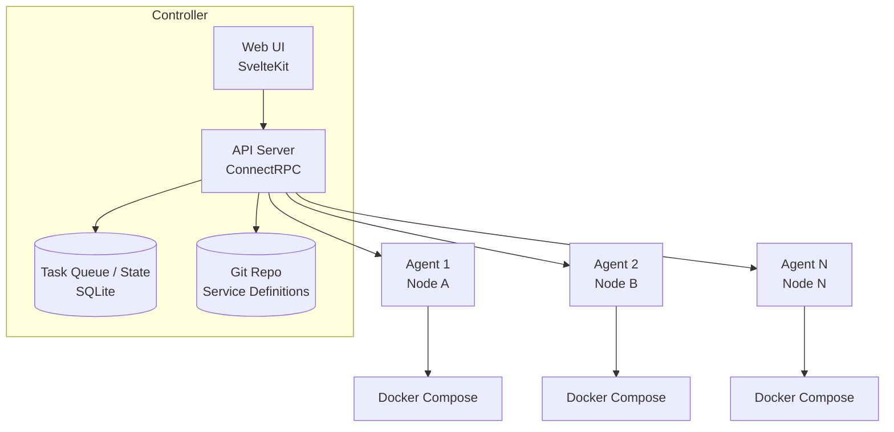
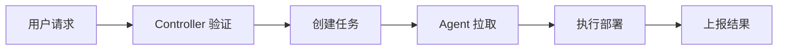
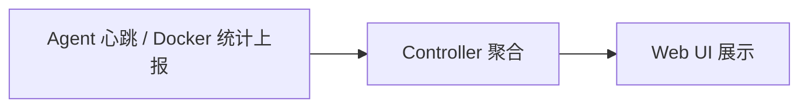
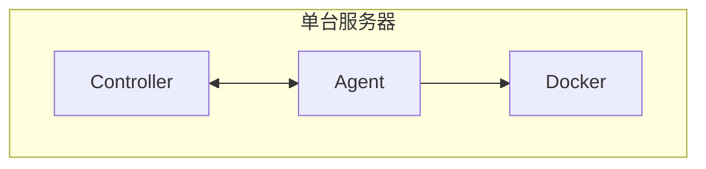
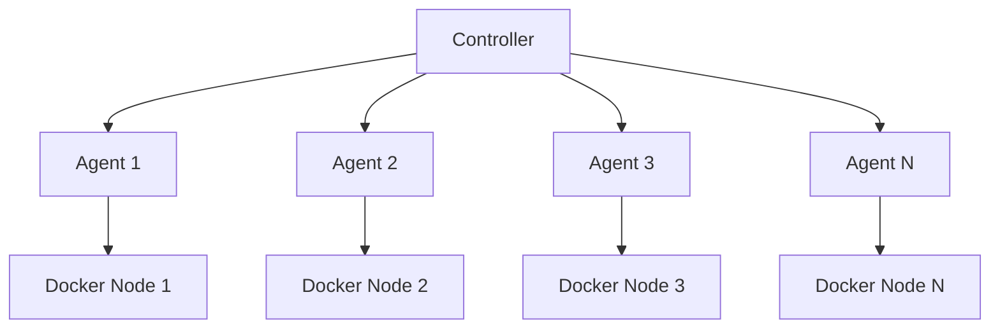

# 架构概览

Composia 采用 Controller-Agent 架构：**Controller** 负责决策和调度，**Agent** 在每个 Docker 主机上执行实际工作。这种模式有时被称为"控制平面"——协调层负责管理实际负载。

## 系统架构

## 核心组件

### Controller

Controller 是系统的中心枢纽——它决定应该发生什么，并将执行委托给 Agent：

| 功能 | 说明 |
|------|------|
| 配置管理 | 从 Git 仓库加载和维护服务定义 |
| 状态聚合 | 收集所有代理的状态信息 |
| 任务调度 | 将部署任务分配给适当的代理 |
| API 服务 | 提供 Web UI 和外部集成接口 |
| 数据持久化 | 使用 SQLite 存储任务和状态 |

### 执行代理（Agent）

代理运行在目标 Docker 主机上：

| 功能 | 说明 |
|------|------|
| 心跳通信 | 定期向 Controller 报告状态（默认 15 秒） |
| 任务执行 | 执行部署、停止、重启等操作 |
| 日志收集 | 收集和转发容器日志 |
| 运行时摘要 | 上报磁盘容量和 Docker 资源统计 |
| Docker 操作 | 直接管理本地 Docker 容器 |

### Web 界面

基于 SvelteKit 构建的现代化管理界面：

- 服务管理：创建、编辑、部署服务
- 节点监控：查看所有代理节点状态
- 容器操作：查看日志、执行命令
- 任务追踪：实时监控任务执行进度

## 通信机制

### ConnectRPC

Composia 使用 ConnectRPC 进行服务间通信：

- 基于 HTTP/2 的双向流
- Protobuf 序列化
- 兼容 gRPC 风格工具与 Connect 客户端（基于 HTTP）
- 支持浏览器直接调用

### 认证方式

| 组件 | 认证方式 |
|------|----------|
| Web UI → Controller | Controller 访问 token（Bearer，来自 `controller.access_tokens`） |
| Agent → Controller | Node Token |
| Controller → Agent | 调用 Controller 暴露的 RPC 时使用 Bearer token |

## 数据流

### 部署流程

1. 用户通过 Web UI 或 API 发起部署请求
2. Controller 验证服务定义和权限
3. 为每个目标节点创建部署任务
4. Agent 通过长轮询获取任务
5. Agent 下载服务 bundle 并执行 Docker Compose 部署
6. Agent 上报执行结果和容器状态

### 状态同步

- Agent 每 15 秒发送一次心跳
- 心跳包含节点在线状态和磁盘摘要
- Agent 还会定期上报 Docker 资源统计
- Controller 聚合所有代理的状态到 SQLite
- Web UI 实时展示最新状态

## 对象模型

Composia 将基础设施建模为四种对象：**Service**（逻辑定义）、**ServiceInstance**（按节点部署实例）、**Container**（实际 Docker 进程）和 **Node**（Docker 主机）。详细关系说明请参见[核心概念](./core-concepts)。

## 安全性

| 层面 | 措施 |
|------|------|
| 认证 | Token-based 身份验证 |
| 传输 | 支持 TLS 加密（生产环境建议启用） |
| 权限 | 最小权限原则，代理只能访问被分配的服务 |
| Secrets | 使用 age 加密存储敏感信息 |

## 扩展性

- **水平扩展**: 添加更多 Agent 节点管理更多 Docker 主机
- **服务扩展**: 同一服务可部署到多个节点
- **负载均衡**: 通过 Caddy 配置实现多实例负载均衡

## 部署模式

### 单节点模式

### 多节点模式

