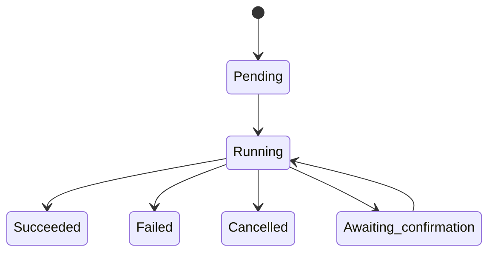

# 日常运维

本文档介绍 Composia 的任务系统、资源管理和常见运维操作。

## 任务系统

### 概述

Composia 使用任务队列管理所有异步操作：

- Controller 负责任务创建和状态管理
- Agent 通过长轮询主动拉取属于自己的任务
- 任务按步骤上报状态、日志和结果

### 任务类型

| 任务类型 | 说明 | 触发方式 |
|----------|------|----------|
| `deploy` | 部署服务 | 手动/API |
| `update` | 更新服务 | 手动/API |
| `stop` | 停止服务 | 手动/API |
| `restart` | 重启服务 | 手动/API |
| `backup` | 执行备份 | 手动/API/定时 |
| `restore` | 恢复备份数据 | 手动/API |
| `dns_update` | 更新 DNS 记录 | 迁移/手动 |
| `migrate` | 迁移服务 | 手动/API |
| `caddy_sync` | 同步 Caddy 配置 | 自动 |
| `caddy_reload` | 重载 Caddy | 自动 |
| `prune` | 清理资源 | 手动/API |
| `rustic_forget` | 清理 rustic 快照索引 | 手动/API/定时 |
| `rustic_prune` | 执行 rustic prune | 手动/API/定时 |
| `docker_list` | 拉取节点 Docker 资源列表 | Web UI/API |
| `docker_inspect` | 查看单个 Docker 资源详情 | Web UI/API |
| `docker_start` | 启动容器 | Web UI/API |
| `docker_stop` | 停止容器 | Web UI/API |
| `docker_restart` | 重启容器 | Web UI/API |
| `docker_logs` | 拉取容器日志 | Web UI/API |

### 任务生命周期



### 查看任务

**Web UI：**
- 「任务」页面显示所有任务列表
- 可按服务、节点、类型、状态筛选
- 点击任务查看详细日志

**任务状态：**

| 状态 | 说明 |
|------|------|
| `pending` | 等待开始 |
| `running` | 正在执行 |
| `awaiting_confirmation` | 等待外部确认步骤完成 |
| `succeeded` | 执行成功 |
| `failed` | 执行失败 |
| `cancelled` | 已取消 |

当任务停在 `awaiting_confirmation` 时，表示 Controller 正在等待人工确认后再继续后续步骤。当前这个状态主要用于迁移流程中的手动验证阶段。

可通过以下方式继续处理：

- 在 Web UI 中批准或拒绝该任务
- 通过 ConnectRPC 调用 `composia.controller.v1.TaskService/ResolveTaskConfirmation`

处理语义：

- `approve`：恢复同一个任务，继续执行后续步骤
- `reject`：结束当前任务，不再继续后续步骤

### 任务日志

任务执行过程中会实时输出日志。当前内置日志主要来自 agent 与 Docker 命令输出，默认以英文为主：

```
starting remote deploy task for service=my-app node=main repo_revision=4f3c2a1b
render step completed after bundle download
Container my-app-1  Started
finalize step completed after compose up
deploy task finished successfully
```

任务来源包括：

- `web`：由 Web UI 触发，包括从 Web 操作派生出的后续任务
- `cli`：由 CLI 或 API 手动触发，包括从 CLI 操作派生出的后续任务
- `others`：由第三方扩展或集成触发，包括从这些操作派生出的后续任务
- `schedule`：由 controller 内置 scheduler 触发
- `system`：由 controller 内部工作流触发

## Docker 资源管理

### 容器管理

Agent 定期上报节点上的 Docker 容器信息，Controller 提供统一的浏览界面。

**查看容器：**
1. 进入某个节点详情页
2. 打开该节点的 Docker 容器视图
3. 查看容器状态、镜像、端口和标签等信息

**容器操作：**

| 操作 | 说明 |
|------|------|
| 查看日志 | 拉取该容器最近的日志输出 |
| Inspect | 查看容器元数据和运行时详情 |
| 终端 | 打开容器 exec 会话（能力仍较基础） |

**查看容器日志：**

```
# 在 Web UI 中
1. 找到目标容器
2. 点击「日志」按钮
3. 加载该容器最近的日志输出
```

**容器终端：**

Web UI 提供容器 exec 入口，但当前仍是较基础的终端能力：

1. 点击容器「终端」按钮
2. 选择 shell（`/bin/sh` 或 `bash`）
3. 建立 WebSocket 会话并执行命令

可用性取决于节点 exec 通道是否在线，以及容器内是否存在对应 shell。

### 镜像管理

**查看镜像：**
- 每个节点各自提供 Docker 镜像页面
- 显示镜像标签、大小和创建时间

**清理镜像：**
可通过 Web UI 操作，或调用 ConnectRPC 方法 `composia.controller.v1.NodeMaintenanceService/PruneNodeDocker`。

### 网络管理

**查看网络：**
- 每个节点各自提供 Docker 网络页面
- 查看网络驱动、子网和容器连接

### 卷管理

**查看卷：**
- 每个节点各自提供 Docker 卷页面
- 查看 Docker 暴露的标签和挂载元数据

## 节点管理

### 节点状态

Agent 每 15 秒发送心跳，包含以下信息：

| 信息 | 说明 |
|------|------|
| 在线状态 | 是否连接到 Controller |
| Docker 版本 | 节点 Docker 版本 |
| 容器数量 | 运行中的容器数 |
| 资源使用 | 磁盘容量与 Docker 资源数量统计 |
| 服务实例 | 该节点上的服务实例列表 |

### 节点视图

**Web UI 提供以下视图：**

- **节点列表**: 查看所有节点概览
- **节点详情**: 单个节点的详细信息
- **节点 Docker 视图**: 按节点查看 containers、images、networks、volumes
- **Dashboard**: 服务、节点和最近任务摘要

### 节点操作

**重新连接 Agent：**

如果 Agent 断开连接：
1. 检查 Agent 容器日志
2. 检查网络连通性
3. 重启 Agent 容器

```bash
docker compose restart agent
```

## 资源清理

### 清理任务

执行 `prune` 任务清理未使用资源：

**Web UI：**
1. 进入「节点」页面
2. 选择目标节点
3. 点击「清理」按钮
4. 选择要清理的资源类型

**API：**

当前 Controller 没有提供 `/api/v1/...` 形式的 REST 接口。
如需通过 API 触发清理，请调用 ConnectRPC 方法 `composia.controller.v1.NodeMaintenanceService/PruneNodeDocker`。

### 自动清理建议

Docker `prune` 仍建议由外部调度系统按需触发。

rustic 的 `forget` 与 `prune` 则可通过 controller 内置 scheduler 定时执行，具体配置见 [备份与迁移](./backup-migrate) 与 [备份配置](./configuration/backup)。

## 日志管理

### 任务日志

任务日志存储在 Controller 的 `log_dir`：

```
log_dir/
├── tasks/
│   ├── <task-id-1>.log
│   ├── <task-id-2>.log
│   └── <task-id-3>.log
```

### 容器日志

容器日志通过 Docker API 实时获取，历史日志由 Docker 管理。

### 日志保留策略

建议配置日志轮转：

```yaml
# docker-compose.yaml
services:
  controller:
    logging:
      driver: "json-file"
      options:
        max-size: "100m"
        max-file: "5"
```

## 监控和告警

### 当前监控能力

- **实时状态**: Web UI 实时显示服务、容器、节点状态
- **资源使用**: 节点磁盘容量和 Docker 资源数量统计
- **日志查看**: 流式任务日志，以及按需拉取的容器日志

### 建议的监控方案

**集成 Prometheus + Grafana：**

在需要监控的节点上部署 node-exporter 和 cadvisor：

```yaml
# monitoring/docker-compose.yaml
services:
  node-exporter:
    image: prom/node-exporter
    volumes:
      - /proc:/host/proc:ro
      - /sys:/host/sys:ro
      - /:/rootfs:ro

  cadvisor:
    image: gcr.io/cadvisor/cadvisor
    volumes:
      - /:/rootfs:ro
      - /var/run:/var/run:ro
      - /sys:/sys:ro
      - /var/lib/docker:/var/lib/docker:ro
```

**自定义告警：**

可将 ConnectRPC 查询方法（例如 `composia.controller.v1.ServiceQueryService/GetService`）与外部告警系统结合使用。

## 故障排查

### 常见问题

**1. Agent 无法连接 Controller**

检查：
- Controller 地址是否正确
- Token 是否匹配
- 网络连通性
- 防火墙设置

**2. 部署失败**

检查：
- 任务日志中的错误信息
- Docker Compose 文件语法
- 镜像是否可拉取
- 端口是否冲突

**3. 服务状态不一致**

检查：
- Agent 是否在线
- 容器是否实际运行
- 标签是否正确设置

**4. Caddy 配置未生效**

检查：
- Caddy 基础设施服务状态
- 配置片段语法
- Agent 目录挂载

### 调试模式

在本地复现运维问题时，建议直接使用明确的配置文件启动：

```bash
# Controller
go run ./cmd/composia controller -config ./dev/config.controller.yaml

# Agent
go run ./cmd/composia agent -config ./dev/config.controller.yaml
```

### 获取支持

- 查看 [GitHub Issues](https://github.com/alexma233/composia/issues)
- 查阅 [开发文档](./development)
- 检查日志文件

## 性能优化

### Controller 优化

- 使用 SSD 存储 `state_dir`
- 定期清理旧任务日志
- 合理设置 `pull_interval`

### Agent 优化

- 确保 Docker socket 访问顺畅
- 监控 Agent 资源使用
- 定期清理未使用资源

## 相关文档

- [部署管理](./deployment) —— 服务部署操作
- [备份与迁移](./backup-migrate) —— 数据保护操作
- [DNS 配置](./dns) —— DNS 配置与更新
- [Caddy 配置](./caddy) —— 代理配置与自动同步
